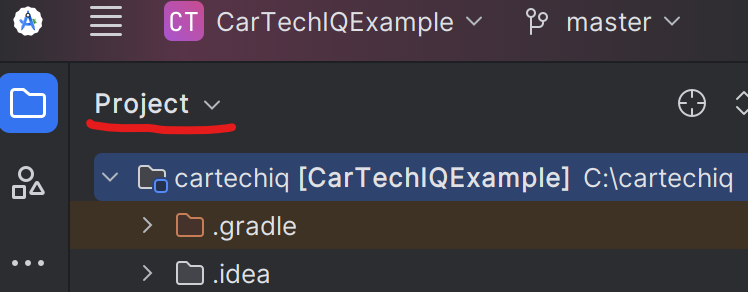
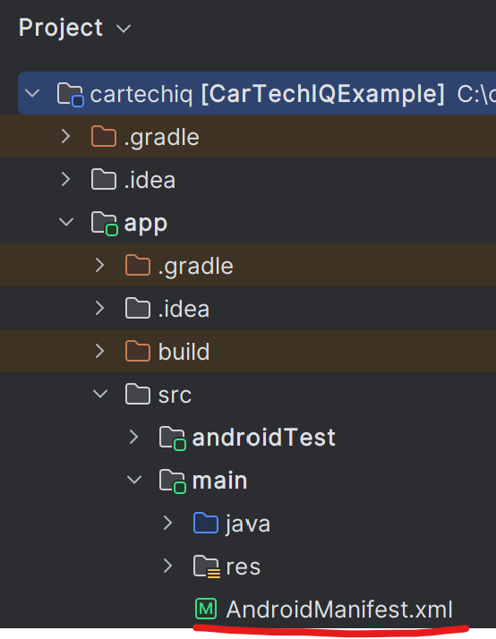
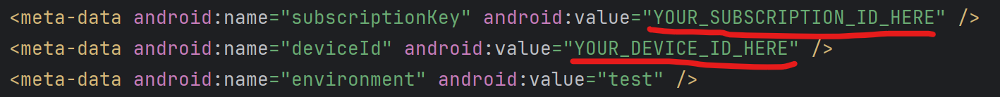
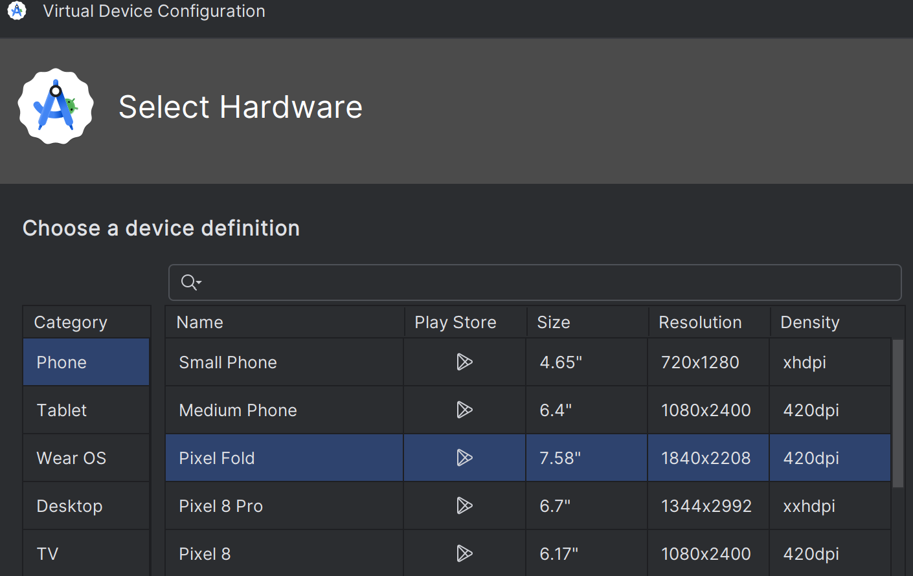
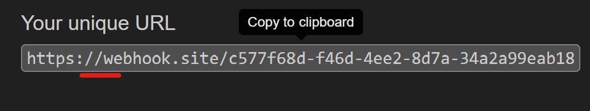
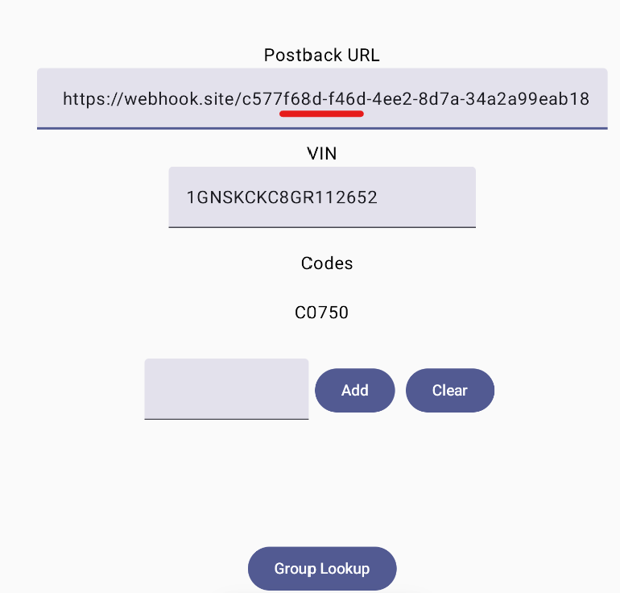
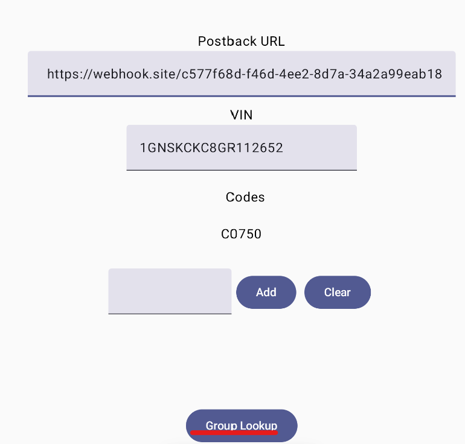
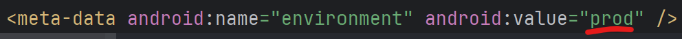

# CarTechIQ Example for Android

This will guide you through setting up the CarTechIQ Example for Android which demonstrates how to talk to the CarTechIQ Api from a basic Android application.

## Setup Steps

1. Clone this repository to your local computer at **C:\cartechiq-android**

2. If you haven't already, download and install Android Studio (free) from https://developer.android.com/studio

3. Open Android Studio. When it asks you for a project, open **C:\cartechiq-android**

4. When asked to Trust the project location, click Trust.

5. Open the Project view in Android Studio:

6. Navigate to **app\src\main\AndroidManifest.xml** and open it.

7. Replace your **YOUR_SUBSCRIPTION_ID_HERE** and **YOUR_DEVICE_ID_HERE** with the subscription id and device ID you received from CarTechIQ.

8. In the top right of Android Studio, make sure "app" is selected from the drop-down and then click the play button.

9. Android Studio may ask you to create a new device emulator. If so, choose the Pixel Fold then click Next, Next again, and Finish.

Note: This example application should work on any modern Android device of any form factor.

10. Open your browser to https://webhook.site/

11. Click the unique webhook URL to copy it to your clipboard

12. Paste the postback URL into the postback field

13. Click the group lookup button

14. After about 30 seconds, you should see a popup containing the raw group lookup results.

15. When you're ready for your application to talk to the CarTechIQ production API, open **app\src\main\AndroidManifest.xml** again and change "test" to "prod"

16. Click the play button again and you should be talking to the production API instead of the test api. If you want to switch back to test, just change it back again in  AndroidManifest.xml.